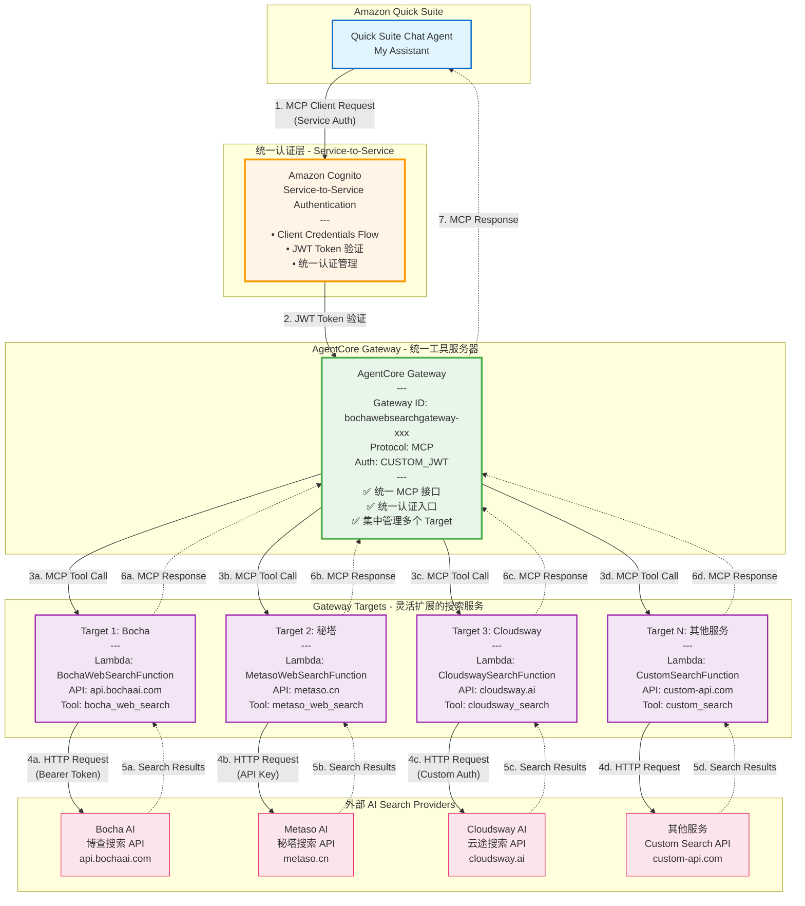
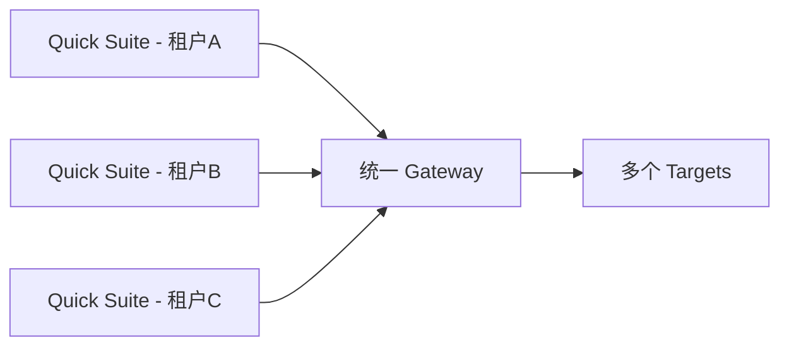

# 🏗️ 架构设计 - AgentCore Gateway 统一认证架构

## 架构概览

本架构展示了如何通过 AgentCore Gateway 实现统一认证管理，通过多个 Gateway Targets 灵活对接外部 AI Search Providers。

### 核心架构流程

```
Amazon Quick Suite (一次配置)
        ↓
Amazon Cognito S2S 认证 (统一认证层)
        ↓
AgentCore Gateway (统一入口)
        ↓
多个 Gateway Targets 对接外部 AI Search Providers (灵活扩展)
  ├── Target 1: Bocha (Lambda → api.bochaai.com)
  ├── Target 2: 秘塔 (Lambda → metaso.cn)  
  ├── Target 3: Cloudsway (Lambda → cloudsway.ai)
  └── Target N: 其他服务 (Lambda → custom-api.com)
```

## Mermaid 架构图



---

## 🎯 架构优势

### 1. 统一认证管理 🔐

**问题**: 每个 AI Search Provider 都有自己的认证方式，管理复杂
- Bocha 使用 Bearer Token
- 秘塔可能使用 API Key
- Cloudsway 可能使用自定义认证
- 每个都需要在 Quick Suite 中单独配置

**解决方案**: 统一在 Cognito 层管理
```
Quick Suite → 只需配置一次 Cognito S2S 认证
            ↓
      AgentCore Gateway ← 统一认证入口
            ↓
    所有 Target 自动继承认证
```

**好处**:
- ✅ Quick Suite 只需配置一次认证
- ✅ 添加新的搜索服务无需修改认证
- ✅ 集中管理凭证和权限
- ✅ 符合企业安全最佳实践

### 2. 灵活的服务对接 🔌

**通过 Lambda 方式的优势**:

```python
# 每个 Lambda 函数独立处理一个服务
# 灵活控制请求格式、错误处理、结果转换

Lambda 1 (Bocha):
  - 请求格式：count, freshness, summary
  - 响应解析：data.webPages.value
  - 特殊处理：UTF-8 编码

Lambda 2 (秘塔):
  - 请求格式：query, limit
  - 响应解析：results[]
  - 特殊处理：图片搜索

Lambda 3 (Cloudsway):
  - 自定义实现...
```

**好处**:
- ✅ 每个服务独立更新，互不影响
- ✅ 灵活的错误处理和重试逻辑
- ✅ 可以添加缓存、日志、监控
- ✅ 支持不同的认证方式
- ✅ 容易调试和维护

### 3. 扩展性强 📈

**添加新服务非常简单**:

```bash
# 步骤 1: 创建新的 Lambda 函数
# 步骤 2: 添加为 Gateway Target
aws bedrock-agentcore-control create-gateway-target \
  --gateway-identifier bochawebsearchgateway-xxx \
  --name NewSearchTarget \
  --target-configuration '...'

# 步骤 3: 立即可用，无需修改 Quick Suite 配置！
```

**好处**:
- ✅ 添加服务只需几分钟
- ✅ Quick Suite 自动发现新工具
- ✅ 无需重新配置认证
- ✅ 支持 A/B 测试不同服务

### 4. 成本优化 💰

**Lambda 按需付费**:
```
只在工具被调用时才产生费用
vs
始终运行的服务器（持续成本）
```

**好处**:
- ✅ 按实际使用付费
- ✅ 自动扩缩容
- ✅ 无需管理服务器
- ✅ 冷启动后性能稳定

---

## 🏢 企业级部署最佳实践

### 当前架构（生产就绪）

```
1 个 Cognito User Pool
  ↓
1 个 AgentCore Gateway
  ↓
N 个 Gateway Targets (Lambda)
  ↓
N 个 AI Search Providers
```

### 扩展场景

#### 场景 1: 多租户支持


#### 场景 2: 多区域部署
```
us-east-1: Gateway + Targets
us-west-2: Gateway + Targets（灾备）
ap-southeast-1: Gateway + Targets（亚太）
```

#### 场景 3: 服务降级
```python
# Lambda 中实现智能降级
if bocha_api_fails:
    fallback_to_metaso()
if metaso_api_fails:
    fallback_to_cloudsway()
```

---

## 📊 性能指标

基于当前部署的测试结果：

| 指标 | 数值 | 说明 |
|------|------|------|
| Token 获取 | < 1s | Cognito 响应快速 |
| ListTools | < 1s | Gateway 工具发现 |
| InvokeTool | < 3s | 端到端搜索完成 |
| 可用性 | 99.9%+ | AWS 托管服务保障 |

---

## 🔮 未来扩展方向

1. **添加更多搜索服务**
   - 秘塔搜索（学术搜索）
   - Cloudsway（企业搜索）
   - Google Search API
   - Bing Search API

2. **智能路由**
   - 根据查询类型自动选择最佳服务
   - 学术查询 → 秘塔
   - 新闻查询 → 博查
   - 企业内容 → Cloudsway

3. **结果聚合**
   - 同时调用多个服务
   - 合并和去重结果
   - 智能排序

4. **高级功能**
   - 结果缓存（ElastiCache）
   - 请求限流
   - 成本控制
   - 使用分析

---

**当前状态**: ✅ 生产就绪  
**测试状态**: ✅ 端到端测试通过  
**文档状态**: ✅ 完整  
**部署状态**: ✅ 成功 (us-east-1)
