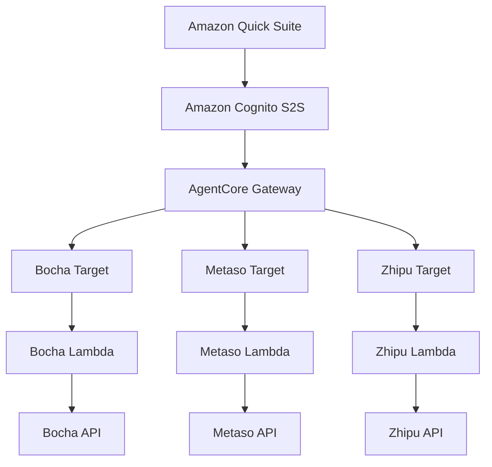

# Amazon Quick Suite AI Search Integration

多 AI 搜索服务集成方案，通过 Amazon Bedrock AgentCore Gateway 将多个 AI Search Providers 集成到 Amazon Quick Suite 中。

## 🎯 项目特点

- ✅ **模块化架构** - 清晰的目录结构，易于扩展
- ✅ **统一认证** - 使用 Cognito S2S 认证，一次配置永久有效
- ✅ **灵活部署** - 按需部署不同的搜索服务
- ✅ **多 Provider 支持** - 目前支持博查和秘塔，可轻松添加更多
- ✅ **完整文档** - 详细的部署和使用文档

## 📁 项目结构

```
amazon-quick-suite-web-search-integration/
├── README.md                      # 本文件
├── deploy_infrastructure.sh       # 基础设施部署脚本
├── config.txt                     # 配置文件（部署后生成）
│
├── utils/                         # 通用工具和脚本
│   ├── setup_cognito.sh          # Cognito S2S 认证设置
│   ├── create_gateway.py         # AgentCore Gateway 创建
│   └── test_gateway.py           # Gateway 测试脚本
│
├── providers/                     # AI Search Providers
│   ├── bocha/                    # 博查搜索
│   │   ├── README.md
│   │   ├── bocha_lambda_function.py
│   │   ├── deploy.sh
│   │   └── add_target.py
│   │
│   ├── metaso/                   # 秘塔搜索
│   │   ├── README.md
│   │   ├── metaso_lambda_function.py
│   │   ├── deploy.sh
│   │   └── add_target.py
│   │
│   └── zhipu/                    # 智谱搜索
│       ├── README.md
│       ├── zhipu_lambda_function.py
│       ├── deploy.sh
│       └── add_target.py
│
├── docs/                          # 文档
│   ├── QUICK_SUITE_SETUP.md      # Quick Suite 配置指南
│   ├── ARCHITECTURE.md           # 架构设计文档
│   └── TROUBLESHOOTING.md        # 故障排除指南
│
└── templates/                     # 模板文件
    ├── lambda_function_template.py
    └── add_new_provider.sh
```

## 🚀 快速开始

### 前置条件

1. **AWS 账户**
   - 创建 IAM 角色和策略的权限
   - Amazon Quick Suite 访问权限（Author Pro）

2. **本地环境**
   - AWS CLI 已配置 (`aws configure`)
   - Python 3.9+
   - jq (JSON 处理工具)

3. **API Keys**
   - 博查 API Key（如需部署博查）
   - 秘塔 API Key（如需部署秘塔）

### 部署步骤

#### 第一步：部署基础设施

```bash
# 克隆项目
git clone <repository-url>
cd amazon-quick-suite-web-search-integration

# 部署 Cognito 和 Gateway
chmod +x deploy_infrastructure.sh
./deploy_infrastructure.sh us-east-1
```

这将创建：
- Cognito User Pool 和 App Client
- AgentCore Gateway
- 配置文件 `config.txt`

#### 第二步：部署 AI Search Providers

##### 选项 A: 部署博查搜索

```bash
# 设置 API Key
export BOCHA_API_KEY="your-bocha-api-key"

# 部署博查
cd providers/bocha
./deploy.sh
python3 add_target.py
cd ../..
```

##### 选项 B: 部署秘塔搜索

```bash
# 设置 API Key
export METASO_API_KEY="your-metaso-api-key"

# 部署秘塔
cd providers/metaso
./deploy.sh
python3 add_target.py
cd ../..
```

##### 选项 C: 部署智谱搜索

```bash
# 设置 API Key
export ZHIPU_API_KEY="your-zhipu-api-key"

# 部署智谱
cd providers/zhipu
./deploy.sh
python3 add_target.py
cd ../..
```

##### 选项 D: 部署全部

```bash
# 部署博查
export BOCHA_API_KEY="your-bocha-api-key"
cd providers/bocha && ./deploy.sh && python3 add_target.py && cd ../..

# 部署秘塔
export METASO_API_KEY="your-metaso-api-key"
cd providers/metaso && ./deploy.sh && python3 add_target.py && cd ../..

# 部署智谱
export ZHIPU_API_KEY="your-zhipu-api-key"
cd providers/zhipu && ./deploy.sh && python3 add_target.py && cd ../..
```

#### 第三步：配置 Quick Suite

参考 [Quick Suite 配置指南](docs/QUICK_SUITE_SETUP.md) 完成配置。

## 🎨 AI Search Providers

### 博查 (Bocha)

- **类型**: 通用网页搜索
- **特点**: 实时性强，新闻覆盖全面
- **适用场景**: 新闻资讯、最新动态、通用网页内容
- **文档**: [providers/bocha/README.md](providers/bocha/README.md)

### 秘塔 (Metaso)

- **类型**: 多类型搜索引擎
- **特点**: 支持 6 种搜索范围
  - 网页 (webpage)
  - 文档 (document)
  - 论文 (paper) ⭐
  - 图片 (image)
  - 视频 (video)
  - 播客 (podcast)
- **适用场景**: 学术研究、技术文档、多媒体内容
- **文档**: [providers/metaso/README.md](providers/metaso/README.md)

### 智谱 (Zhipu)

- **类型**: 大模型优化搜索引擎
- **特点**: 
  - 多搜索引擎支持（标准版、专业版、搜狗、夸克）
  - 时间范围过滤
  - 域名白名单过滤
  - 摘要长度控制
  - 搜索意图识别
- **适用场景**: 精确搜索、时效性内容、特定网站搜索
- **文档**: [providers/zhipu/README.md](providers/zhipu/README.md)

## 🎯 使用示例

### 在 Quick Suite 中测试

#### 博查搜索
```
使用博查搜索查找关于 AWS Lambda 的最新信息
```

#### 秘塔搜索
```
使用秘塔搜索查找关于量子计算的学术论文
```

#### 智谱搜索
```
使用智谱搜索查找关于量子计算的最新进展，只看最近一周的内容
```

#### 对比搜索
```
分别使用博查、秘塔和智谱搜索关于"人工智能"的信息，并对比结果
```

## 📊 架构说明



**核心优势**:
- 统一认证：Quick Suite 只需配置一次
- 灵活扩展：可轻松添加新的搜索服务
- 独立部署：每个 Provider 独立管理

详细架构说明请参考 [ARCHITECTURE.md](docs/ARCHITECTURE.md)

## 🔧 管理和维护

### 查看配置

```bash
cat config.txt
```

### 测试 Gateway

```bash
cd utils
python3 test_gateway.py
```

### 查看日志

```bash
# 博查日志
aws logs tail /aws/lambda/BochaWebSearchFunction --follow

# 秘塔日志
aws logs tail /aws/lambda/MetasoWebSearchFunction --follow

# 智谱日志
aws logs tail /aws/lambda/ZhipuWebSearchFunction --follow
```

### 更新 API Key

```bash
# 更新博查 API Key
aws lambda update-function-configuration \
  --function-name BochaWebSearchFunction \
  --environment Variables={BOCHA_API_KEY=new-key}

# 更新秘塔 API Key
aws lambda update-function-configuration \
  --function-name MetasoWebSearchFunction \
  --environment Variables={METASO_API_KEY=new-key}

# 更新智谱 API Key
aws lambda update-function-configuration \
  --function-name ZhipuWebSearchFunction \
  --environment Variables={ZHIPU_API_KEY=new-key}
```

## ➕ 添加新的 Provider

1. 在 `providers/` 下创建新目录
2. 使用 `templates/lambda_function_template.py` 创建 Lambda 函数
3. 创建 `deploy.sh` 和 `add_target.py` 脚本
4. 参考现有 Provider 的 README 编写文档
5. 测试并部署

详细步骤请参考 `templates/add_new_provider.sh`

## 📚 文档

- [Quick Suite 配置指南](docs/QUICK_SUITE_SETUP.md) - Quick Suite 配置步骤
- [架构设计](docs/ARCHITECTURE.md) - 详细的系统架构
- [故障排除](docs/TROUBLESHOOTING.md) - 常见问题解决
- [博查 Provider](providers/bocha/README.md) - 博查搜索文档
- [秘塔 Provider](providers/metaso/README.md) - 秘塔搜索文档
- [智谱 Provider](providers/zhipu/README.md) - 智谱搜索文档

## 💰 成本估算

基于每月 1000 次搜索：

| 服务 | 月成本 |
|------|--------|
| Cognito | ~$0 |
| Lambda 调用 | ~$0.20 |
| Lambda 执行 | ~$0.10 |
| Gateway | ~$5 |
| 博查 API | 根据订阅 |
| 秘塔 API | 根据订阅 |
| 智谱 API | 0.01-0.05元/次 |
| **基础设施总计** | **~$5.30** |

## 🔒 安全最佳实践

1. **保护配置文件**
   - 不要将 `config.txt` 提交到版本控制
   - 使用 `.gitignore` 忽略敏感文件

2. **API Key 管理**
   - 定期轮换 API Keys
   - 生产环境使用 AWS Secrets Manager

3. **权限控制**
   - 使用最小权限原则配置 IAM
   - 定期审查权限

4. **监控和日志**
   - 启用 CloudWatch 监控
   - 定期检查日志

## 🐛 故障排除

### 常见问题

1. **基础设施部署失败**
   - 检查 AWS 凭证配置
   - 确认有足够的 IAM 权限
   - 查看详细错误信息

2. **Provider 部署失败**
   - 确认基础设施已部署
   - 检查 API Key 是否正确
   - 查看 Lambda 日志

3. **Quick Suite 连接失败**
   - 确认配置参数正确
   - 等待 1-2 分钟让系统生效
   - 检查 Gateway 状态

详细故障排除请参考 [TROUBLESHOOTING.md](docs/TROUBLESHOOTING.md)

## 🤝 贡献

欢迎贡献新的 AI Search Provider！

1. Fork 本项目
2. 创建新的 Provider
3. 测试并编写文档
4. 提交 Pull Request

## 📄 许可证

MIT License

## 📞 支持

- GitHub Issues: 提交问题和建议
- 文档: 查看完整文档
- AWS Support: AWS 服务相关问题

---

**版本**: 2.0  
**最后更新**: 2025年10月  
**维护者**: AWS Solutions Team
